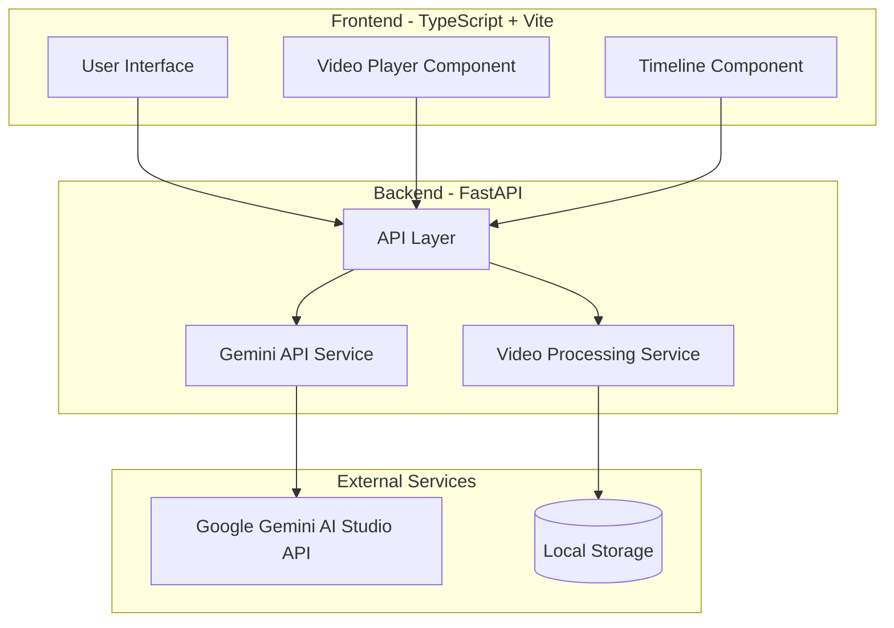

# Fencing Video Judge Application

A web application for analyzing fencing videos using Google's Gemini AI to detect and annotate fencing actions.

## Architecture

This project follows a client-server architecture:

- **Frontend**: React with TypeScript, built with Vite
- **Backend**: FastAPI (Python)
- **AI Integration**: Google Gemini API for video understanding



## Features

- Upload fencing videos
- Play videos with standard controls
- Analyze videos using Google's Gemini AI
- Display detected fencing actions on a timeline
- Navigate to specific actions in the video
- View detailed analysis of fencing bouts

## Setup and Installation

### Prerequisites

- Python 3.8+
- Node.js 18+
- pnpm (for frontend package management)
- Google Gemini API key

### Backend Setup

1. Navigate to the backend directory:
   ```
   cd backend
   ```

2. Create and activate a virtual environment:
   ```
   python -m venv .venv
   source .venv/bin/activate  # On Windows: .venv\Scripts\activate
   ```

3. Install dependencies:
   ```
   pip install -r requirements.txt
   ```

4. Set up environment variables:
   ```
   export GEMINI_API_KEY=your_api_key_here
   ```

5. Run the server:
   ```
   uvicorn main:app --reload
   ```

### Frontend Setup

1. Navigate to the frontend directory:
   ```
   cd frontend
   ```

2. Install dependencies:
   ```
   pnpm install
   ```

3. Start the development server:
   ```
   pnpm dev
   ```

4. Open your browser and navigate to `http://localhost:5173`

## Usage

1. Upload a fencing video using the upload form
2. Select the video from the list of uploaded videos
3. Click "Analyze Video" to process the video with Gemini AI
4. View the detected actions on the timeline
5. Click on timeline markers to navigate to specific actions
6. Review the detailed analysis in the analysis section

## Project Structure

```
fencing-judge/
├── backend/
│   ├── app/
│   │   ├── api/
│   │   │   ├── __init__.py
│   │   │   └── routes.py
│   │   ├── models/
│   │   │   ├── __init__.py
│   │   │   └── schemas.py
│   │   ├── services/
│   │   │   ├── __init__.py
│   │   │   ├── gemini_service.py
│   │   │   └── video_processor.py
│   │   └── __init__.py
│   ├── uploads/
│   └── main.py
├── frontend/
│   ├── public/
│   ├── src/
│   │   ├── assets/
│   │   ├── components/
│   │   │   ├── Timeline.css
│   │   │   ├── Timeline.tsx
│   │   │   └── VideoPlayer.tsx
│   │   ├── services/
│   │   │   └── api.ts
│   │   ├── App.css
│   │   ├── App.tsx
│   │   ├── index.css
│   │   └── main.tsx
│   ├── index.html
│   ├── package.json
│   └── tsconfig.json
└── README.md
```

## Future Enhancements

1. Add expert review interface
2. Implement fencing-specific scoring logic
3. Enhance timeline and visualization capabilities
4. Add user authentication and management
5. Expand to other fencing types (épée, sabre)

## License

MIT
